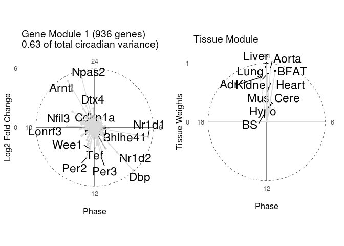

Data and functions to analyze circadian gene expression across tissues. Clone of https://bitbucket.org/jakeyeung/circadianrnaseq but removed files >100MB (github limit)    

	# Jake Yeung
    # Date of Creation: 2019-11-27
    # File: ~/projects/CircadianRNASeq/README.R
    # Test things out before moving to Rmd

    library(reshape2)
    library(dplyr)

    ## 
    ## Attaching package: 'dplyr'

    ## The following objects are masked from 'package:stats':
    ## 
    ##     filter, lag

    ## The following objects are masked from 'package:base':
    ## 
    ##     intersect, setdiff, setequal, union

    library(ggplot2)

    ## RStudio Community is a great place to get help:
    ## https://community.rstudio.com/c/tidyverse.

    library(hash)

    ## hash-2.2.6.1 provided by Decision Patterns

    library(CircadianRNASeq)
    library(here())

    ## here() starts at /home/yeung/projects/CircadianRNASeq

    setwd(here())

Load data
---------

    inf <- "data/GR_2018_Primetime_Objects.Rdata"
    suppressMessages(load(inf, v=F))

Plot some genes
---------------

    jgene <- "Dbp"
    dat.sub <- subset(dat.long, gene == jgene)

**Expression of Dbp across tissues and time from Hogenesch data: **
`#+ fig.width=4, fig.height=4, dpi=50`

    PlotGeneAcrossTissues(dat.sub) + theme_bw()  + theme(aspect.ratio = 1, legend.position = "none")

we do model selection to identify rhythmic parameters shared or
differenet across tissues \#\#\# Model selection output automatically
groups tissues by rhythmic parameters

    jgene.byparam <- "Ube2u"
    PlotGeneByRhythmicParameters(fits.long, subset(dat.long, experiment == "array"),
                                      jgene.byparam, amp.filt = 0.2, jtitle=jgene.byparam, facet.rows = 1, jcex = 8,
                                      pointsize = 0)

    ## Warning: Detecting old grouped_df format, replacing `vars` attribute by
    ## `groups`

Here we show a liver-specific rhythmic gene. We plot just the microarray
data for visualization purposes, although the model is fit on both
microarray and RNA-seq together. \#\#\# Plot genes for WT and KO to see
whether a gene is clock-controlled or clock-independent (e.g., driven by
feeding rhythms)

*Dbp* is clock controlled, because it is flat in Bmal1 KO \#\#\# WT vs
KO DBP:

    PlotGeneTissuesWTKO(subset(dat.wtko, gene == jgene), jtitle = jgene, jsize = 10, single.day = TRUE)

    ## Warning: Detecting old grouped_df format, replacing `vars` attribute by
    ## `groups`

    ## Warning: filter_() is deprecated. 
    ## Please use filter() instead
    ## 
    ## The 'programming' vignette or the tidyeval book can help you
    ## to program with filter() : https://tidyeval.tidyverse.org
    ## This warning is displayed once per session.

    ## Warning: mutate_() is deprecated. 
    ## Please use mutate() instead
    ## 
    ## The 'programming' vignette or the tidyeval book can help you
    ## to program with mutate() : https://tidyeval.tidyverse.org
    ## This warning is displayed once per session.

    ## Warning: group_by_() is deprecated. 
    ## Please use group_by() instead
    ## 
    ## The 'programming' vignette or the tidyeval book can help you
    ## to program with group_by() : https://tidyeval.tidyverse.org
    ## This warning is displayed once per session.

    ## Warning: summarise_() is deprecated. 
    ## Please use summarise() instead
    ## 
    ## The 'programming' vignette or the tidyeval book can help you
    ## to program with summarise() : https://tidyeval.tidyverse.org
    ## This warning is displayed once per session.

The model selection for dat.wtko object is called \`fits.long.filt\`\`,
here I show that Dbp is rhythmic in liver and kidney wild type, but not
KO

    print(subset(fits.long.filt, gene == jgene))

    ## Warning: Detecting old grouped_df format, replacing `vars` attribute by
    ## `groups`

    ## # A tibble: 1 x 12
    ## # Groups:   gene, method [1]
    ##   gene  model weight weight.raw param.list method n.params n.rhyth amp.avg
    ##   <fct> <fct>  <dbl>      <dbl> <list>     <chr>     <int>   <int>   <dbl>
    ## 1 Dbp   Live~  0.966      -48.7 <dbl [6]>  g=1001        1       2    2.83
    ## # ... with 3 more variables: phase.sd <dbl>, phase.maxdiff <dbl>,
    ## #   phase.avg <dbl>

Complex-valued SVD
------------------

summarize tissue-wide genes using complex-valued SVD, a compact way to
visualize how modules of genes oscillate across tissues

    svdcomponent <- 1  # look at first singular values, which captures the most variance
    genes.tw <- as.character(subset(fits.long, n.rhyth >= 8)$gene)
    genes.tw.wtko <- as.character(subset(fits.long.filt, model %in% c("Liver_SV129,Kidney_SV129"))$gene)

    # on Hogenesch data
    s.tw <- SvdOnComplex(subset(dat.complex, gene %in% genes.tw), value.var = "exprs.transformed")

    ## Warning: Detecting old grouped_df format, replacing `vars` attribute by
    ## `groups`

    # on Naef data
    s.tw.wtko <- SvdOnComplex(subset(dat.freq, gene %in% genes.tw.wtko), value.var = "exprs.transformed")

    ## Warning: Detecting old grouped_df format, replacing `vars` attribute by
    ## `groups`

    eigens.tw <- GetEigens(s.tw, period = 24, comp = svdcomponent, add.arrow = TRUE, jsize = 12, label.n = 15, eigenval = TRUE, adj.mag = TRUE, constant.amp = dotsize, peak.to.trough = TRUE, label.gene = c("Dbp", "Arntl", "Per2", "Nr1d1"))

    ## Warning in if (!is.na(label.gene)) {: the condition has length > 1 and only
    ## the first element will be used

    jlayout <- matrix(c(1, 2), 1, 2, byrow = TRUE)

### Tissue-wide SVD module

    multiplot(eigens.tw$u.plot, eigens.tw$v.plot, layout = jlayout)

The gene loadings show how the phase and amplitude relates to each
other. For example, we find *Arntl* to oscillate in phase with *Npas2*
across tissues, but antiphasic with *Dbp*.

The tissue loadings show how the oscillations of each gene relates
across tissues. Here we see in this tissue-wide module that these genes
oscillate in nearly all tissues, with coherent phases. However, we find
the amplitudes vary (we often see brain tissues have lower amplitudes
than other tissues like liver)

    eigens.tw.wtko <- GetEigens(s.tw.wtko, period = 24, add.arrow = TRUE, comp = svdcomponent, jsize = 12, label.n = 15, eigenval = TRUE, adj.mag = TRUE, constant.amp = dotsize, peak.to.trough = TRUE, label.gene = c("Dbp", "Arntl", "Per2", "Nr1d1"))

    ## Warning in if (!is.na(label.gene)) {: the condition has length > 1 and only
    ## the first element will be used

    jlayout <- matrix(c(1, 2), 1, 2, byrow = TRUE)

### Tissue-wide SVD module on WT and KO data

    multiplot(eigens.tw.wtko$u.plot, eigens.tw.wtko$v.plot, layout = jlayout)

Here we find the gene loadings of the clock-controlled genes to be very
comparable to the Hogenesch data (Hogenesch data will contain both
clock-controlled and clock-independent genes). The addition of WT and
/Bmal1/ KO data now shows that indeed these genes are clock-controlled:
we see the amplitudes of these genes in kidney and liver /Bmal1/ KO
data.
