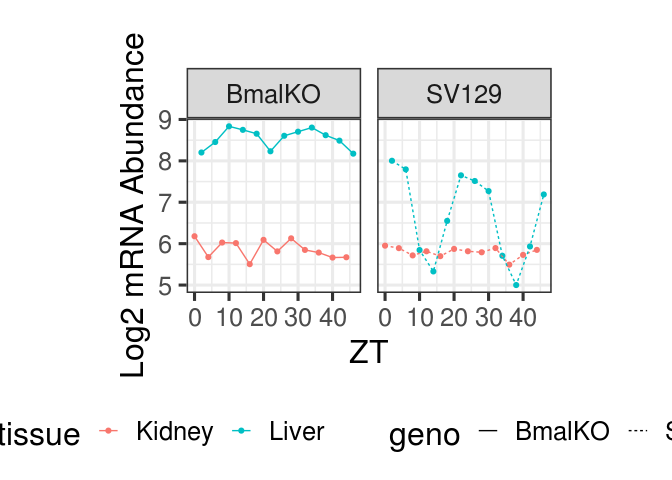
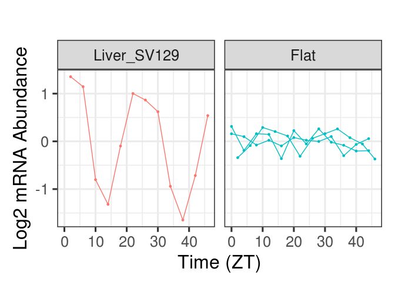

    # Jake Yeung
    # Date of Creation: 2020-08-03
    # File: ~/projects/CircadianRNASeq/test_nconds_fits.R
    # Test nconds fits

    library(CircadianRNASeq)
    # library(Matrix)
    # library(hash)
    # library(numbers)  # easy bell number calculation
    # library(ggplot2)

Load data
---------

    data(dat_long_WTKO, verbose=TRUE)

    ## Warning in find.package(package, lib.loc, verbose = verbose): package 'lazyeval' found more than once, using the first from
    ##   "/usr/lib64/R/library/lazyeval",
    ##   "/home/yeung/R/x86_64-redhat-linux-gnu-library/3.6/lazyeval"

    ## Warning in find.package(package, lib.loc, verbose = verbose): package 'reshape2' found more than once, using the first from
    ##   "/home/yeung/R/x86_64-redhat-linux-gnu-library/3.6/reshape2",
    ##   "/usr/lib64/R/library/reshape2"

    ## Warning in find.package(package, lib.loc, verbose = verbose): package 'usethis' found more than once, using the first from
    ##   "/home/yeung/R/x86_64-redhat-linux-gnu-library/3.6/usethis",
    ##   "/usr/lib64/R/library/usethis"

    ## name=dat_long_WTKO:   NOT found in names() of Rdata.rds, i.e.,
    ##  french_fries,smiths,tips

    ## name=dat_long_WTKO:   NOT found in names() of Rdata.rds, i.e.,
    ##  diamonds,economics,economics_long,faithfuld,luv_colours,midwest,mpg,msleep,presidential,seals,txhousing

    ## name=dat_long_WTKO:   NOT found in names() of Rdata.rds, i.e.,
    ##  band_instruments,band_instruments2,band_members,nasa,starwars,storms

    ## name=dat_long_WTKO:   found in Rdata.rds

Run fits
========

Subset data to just two genes for the tutorial

    dat.long <- subset(dat_long_WTKO, gene %in% c("Nr1d1", "Insig2"))

    dat.long.forplot <- dat.long %>%
      rowwise() %>%
      mutate(geno = strsplit(as.character(tissue), "_")[[1]][[2]],
             tissue = strsplit(as.character(tissue), "_")[[1]][[1]])

Expression of Insig2, a gene that is rhythmic in only one of the four
conditions (Liver WT):

    PlotGeneTissuesWTKO(subset(dat.long.forplot, gene == "Insig2"))

    tissues.uniq <- unique(as.character(dat.long$tissue))
    dat.env <- DatLongToEnvironment(dat.long)

    method <- "g=1000"  # Method for penalizing model complexity: other possibilities: BIC, or g={integer}
    jstart <- Sys.time()
    print("Running fits...")

    ## [1] "Running fits..."

    fits.all <- lapply(ls(dat.env), function(gene){
      MakeDesMatRunFitEnv(dat.env, gene, tissues.uniq,
                          n.rhyth.max = length(tissues.uniq), w = 2 * pi / 24,
                          criterion = method, normalize.weights = TRUE,
                          cutoff = 1e-5, top.n = NULL, sparse = FALSE)
    })
    print("Running fits... done")

    ## [1] "Running fits... done"

    print(Sys.time() - jstart)

    ## Time difference of 0.4967411 secs

    n.combos <- numbers::bell(length(tissues.uniq) + 1)
    fits.all.long <- lapply(fits.all, function(x){
      gene <- x$gene
      x$gene <- NULL
      fits.temp.long <- ListToLong(x, gene, top.n = n.combos)
    })
    fits.all.long <- do.call(rbind, fits.all.long)

    fits.long.filt.subset <- fits.all.long %>%
      group_by(gene) %>%
      filter(weight.raw == min(weight.raw))

    ## Warning: Grouping rowwise data frame strips rowwise nature

    print(fits.long.filt.subset$param.list[[1]])

    ##   tissueLiver_SV129  tissueKidney_SV129  tissueLiver_BmalKO 
    ##            6.648376            5.793068            8.543400 
    ## tissueKidney_BmalKO     Liver_SV129.amp   Liver_SV129.phase 
    ##            5.866585            1.357170            1.713487

The model allows automatic separation between oscillatory conditions
(here Insig2 oscillates in only Liver WT) versus "flat" conditions (all
other conditions):

    jgene <- "Insig2"

Model separates between oscillating conditions versus flat conditions

    PlotGeneByRhythmicParameters(fits.long.filt.subset, dat_long_WTKO, jgene) + xlab("Time (ZT)")

